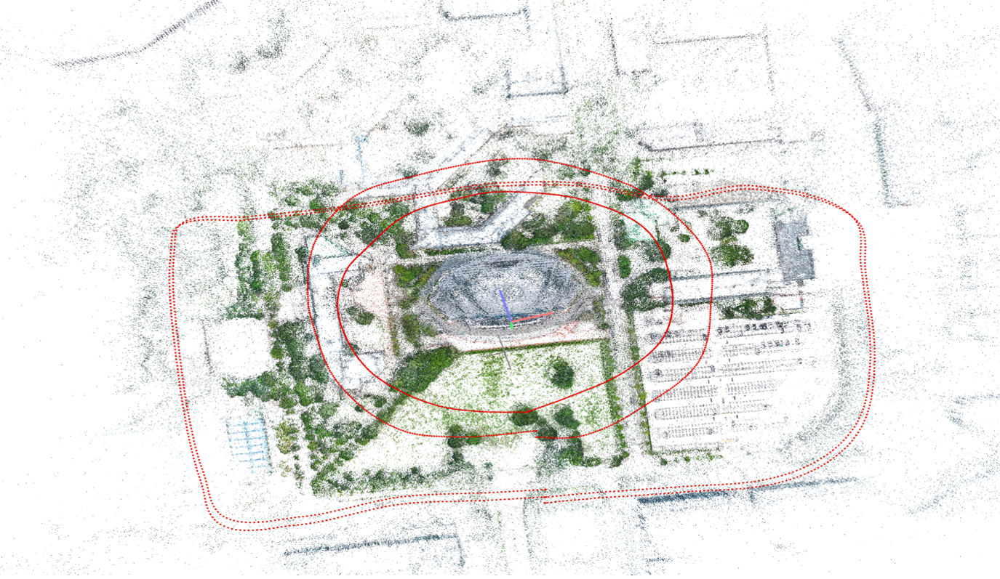
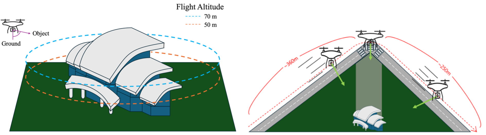
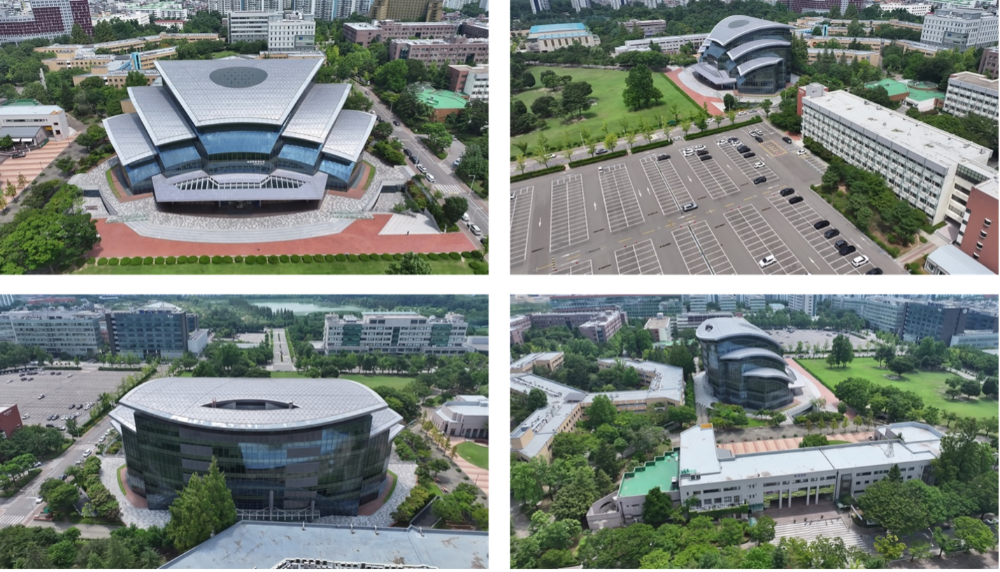

# Library

> **Official MPEG 3D Gaussian Splatting (3DGS) Test Dataset**  
> Selected for **ISO/IEC JTC 1/SC 29/WG 4 (MPEG) – Gaussian Splat Coding (GSC) Common Test Conditions**

**Institution:** Sungkyunkwan University (SKKU)  
**Captured by:** MCSL & Department of Immersive Media Engineering  
**Version:** October 2025  
**Source:** [Download Dataset](http://gofile.me/6uap5/r5zzOBuMZ)

---

## 🖼️ Visual Overview

Representative images from the **Library Sequence**, captured on the SKKU main campus.  
They illustrate the dataset’s **architectural scale**, **lighting diversity**, and **reflective surfaces**.

---

### Aerial Overview

---

### Drone Path

---

### Render

> The images above are sample previews.  
> Full-resolution 4K imagery and corresponding calibration data are available in the linked dataset.

---

## 🏛️ Overview

The **Library Sequence** is a large-scale **3D Gaussian Splatting dataset** captured at **Sungkyunkwan University’s central library area**, featuring both aerial and ground-level perspectives.  
It provides **high-resolution image sequences** for evaluating **Gaussian Splatting**, **3D reconstruction**, and **view-synthesis** techniques.

The dataset replicates **real-world campus-scale environments** with complex **lighting**, **architectural**, and **specular reflection** characteristics, making it suitable for evaluating realistic rendering and coding systems.

---

## 📷 Capture Specifications

| Property | Description |
|-----------|-------------|
| **Capture Device** | DJI Mavic 3 Pro (Tele Lens 166 mm @ f/3.4) |
| **Altitude** | 50 m / 70 m |
| **Resolution** | 4K (4096 × 2160) |
| **Coverage Area** | Approx. 98,000 m² (Library & Courtyard Zone) |
| **Total Images** | ~173,000 |
| **Environment** | Outdoor daylight, varying illumination and reflections |

---

## 🌤️ Scene Characteristics

- **Architectural diversity:** combination of glass, stone, and concrete façades  
- **Dynamic lighting:** morning to late-afternoon captures with moving shadows  
- **Reflective materials:** large window façades and metal panels for specular effects  
- **Outdoor openness:** trees, paths, and plazas with wide-area continuity  
- **Realistic complexity:** natural lighting transitions ideal for photometric testing  

---

## 📄 Citation and References

If you use or refer to this dataset, please cite:

Additional references for the MPEG standardization context:

> **ISO/IEC JTC 1/SC 29/WG 4 (MPEG Video Coding Group)**  
> *Gaussian Splat Coding (GSC) – Common Test Conditions (CTC)*  
> Contribution: ISO/IEC JTC 1/SC 29/WG 4 m74011, Geneva, October 2025.  
>  
> **Library Sequence** was officially introduced and adopted as a **representative large-scale scene** for GSC evaluation,  
> providing coverage of architectural, specular, and outdoor conditions suitable for **Gaussian-based 3D scene coding** experiments.

---

## 🔗 Related Links

- MPEG WG 4 (Video Coding) — Gaussian Splat Coding (GSC)  
- MCSL, Sungkyunkwan University — [http://mcsl.skku.edu/](http://mcsl.skku.edu/)  
